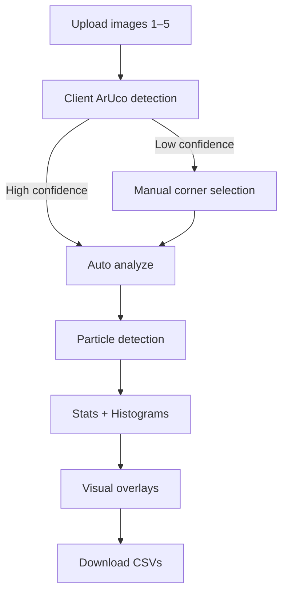

# PSD Web App Specification
## Version 02 (Consolidated, Detailed)

---

# 1. Overview

This application analyzes photographs of coffee grinds captured on mobile devices against a printed ArUco marker template to compute particle size distributions (PSD).

The system provides:

• Automatic scale detection via ArUco markers  
• Illumination‑robust particle segmentation  
• Per‑particle measurements  
• PSD histograms (count / surface / mass weighted)  
• Statistical summaries (D10/D50/D90 etc.)  
• Visual overlays for validation  
• CSV exports  
• Multi‑image aggregation & comparison  

Primary design philosophy:

**Client‑first computer vision with optional server assist**

This minimizes server cost while maintaining accuracy and transparency.

---

# 2. High Level Architecture

## 2.1 Strategy

• Client performs all CV by default  
• Server stores results + optional fallback processing  
• No Python required  
• Node + React only  

## 2.2 Technology Stack

Server
• Node / Express
• ES modules
• no semicolons

Client
• React
• Material UI
• Nivo charts
• Web Workers for heavy CV

Shared
• Schemas
• Constants
• Analysis utilities

---

# 3. System Flow

## 3.1 User Flow



## 3.2 Analysis Pipeline


---

# 4. Template Identification (ArUco)

## 4.1 Requirement

Each template uses **unique corner marker IDs**.

| Template | Corner IDs |
|----------|------------|
| 100 mm | 0,1,2,3 |
| 50 mm | 10,11,12,13 |

## 4.2 Detection Rules

1. Detect markers
2. Collect IDs
3. Match to known template set
4. ≥3 matches → infer template
5. Else → manual fallback

## 4.3 Confidence

| Condition | Confidence |
|-----------|------------|
| 4 markers | High |
| 3 markers | Medium |
| ≤2/mixed | Low |

Low → user prompted to adjust.

## 4.4 Boundaries

• Outer corners → pixel scale  
• Inner corners → analysis ROI  
• Apply inset (default 8 px)

---

# 5. Image Processing Pipeline

## 5.1 Warp

• Homography to square  
• Default resolution: 2000×2000  

## 5.2 Illumination Correction

Gaussian blur background estimate  
Divide or subtract to flatten lighting  

## 5.3 Threshold

Adaptive Gaussian threshold

## 5.4 Cleanup

Morphology open/close

## 5.5 Segmentation

Connected components

## 5.6 Optional Overlap Separation

Distance transform + watershed  
Conservative by default  

---

# 6. Particle Metrics

Per particle:

• centroid (px)
• area (px²)
• equivalent diameter (µm)
• optional: perimeter, circularity

Diameter:
d = 2√(A/π)

---

# 7. Distributions

## 7.1 Weighting Modes

• Count  
• Surface area  
• Volume (mass proxy ∝ d³)

## 7.2 Bin Settings

Default:
• 30 bins
• log spacing

## 7.3 Histogram CSV

binStart, binEnd, binCenter, value, percent

---

# 8. Statistics

Displayed:

• px/mm, mm/px  
• D10 / D50 / D90 (current weighting mode)  
• Mode  
• Mean  
• StdDev  
• Min / Max  
• Particle count  

---

# 9. Multi Image Support

• Up to 5 images  
• View single / aggregate / comparison  

Aggregation methods:
• pooled particles (default)
• average histograms

---

# 10. Visualization

Modes:

• Original  
• Threshold mask  
• Overlay  

Overlay layers:

• Scale boundary  
• Analysis region  
• ArUco markers  
• Particle outlines  

Charts:

• Bar or line (Nivo)

---

# 11. Exports

Per image:

• particles.csv  
• stats.csv  
• histogram.csv  
• overlay.png  

---

# 12. Reproducibility

Each result stores:

analysisVersion  
parameters  
templateSize  
pixelScale  
timestamp  

All parameters persisted with outputs.

---

# 13. Presets

Default (phone)  
Coarse  
Fines/macro  

Advanced exposes all parameters.

---

# 14. Failure Handling

Warn user if:

• low ArUco confidence  
• uneven lighting  
• markers cropped  
• too many boundary touches  

Manual crop available.

---

# 15. API Endpoints

## POST /api/psd/analyze (optional server assist)
Input:
• image
• parameters

Returns:
• particles
• stats
• histograms
• overlay

## POST /api/psd/aruco
Input:
• image
Returns:
• detected corners
• template size
• confidence

## POST /api/psd/upload
Stores artifacts

## GET /api/psd/result/:id
Fetch stored result

---

# 16. Project Structure (Boilerplate‑aligned)

```text
root
  client/
    src/
      features/psd/
        analysis/
          analyzeImage.js
          imageNormalization.js
          boundaryDetection.js
          warpPerspective.js
          particleDetection.js
          overlapSeparation.js
          buildHistograms.js
          calculateStatistics.js
          renderOverlays.js
          exportCsv.js
        components/
          UploadQueue.jsx
          ImageViewer.jsx
          OverlayToggles.jsx
          HistogramPanel.jsx
          StatsTable.jsx
          ParameterPanel.jsx
  server/
    src/
      routes/psd/
        analyze.js
        aruco.js
        upload.js
  shared/
    schemas/
    constants/
```

---

# 17. Default Parameters

Warp: 2000×2000  
bgSigma: 35  
blockSize: 71  
C: 4  
bins: 30  
spacing: log  
overlap split: OFF  
inset: 8px  

---

# 18. Implementation Notes

• Client-first is primary path  
• Server is optional assist only  
• Always show overlays for trust  
• Always persist parameters + version  
• Keep algorithms deterministic  

